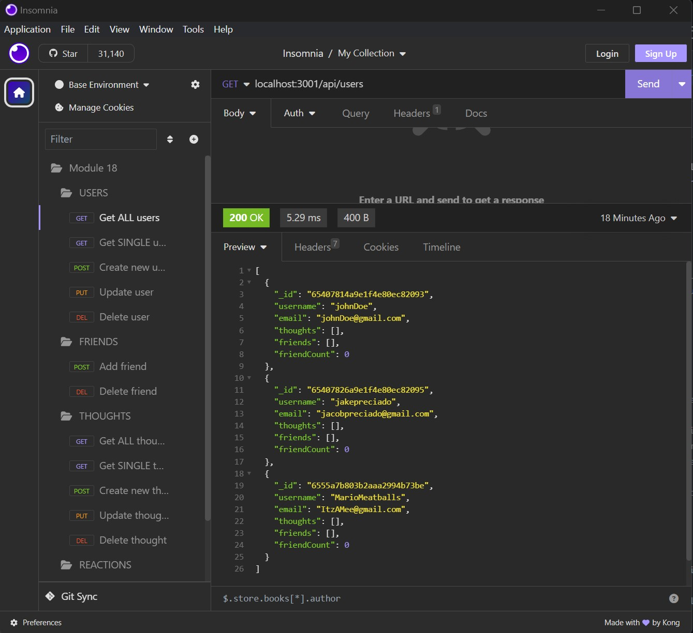
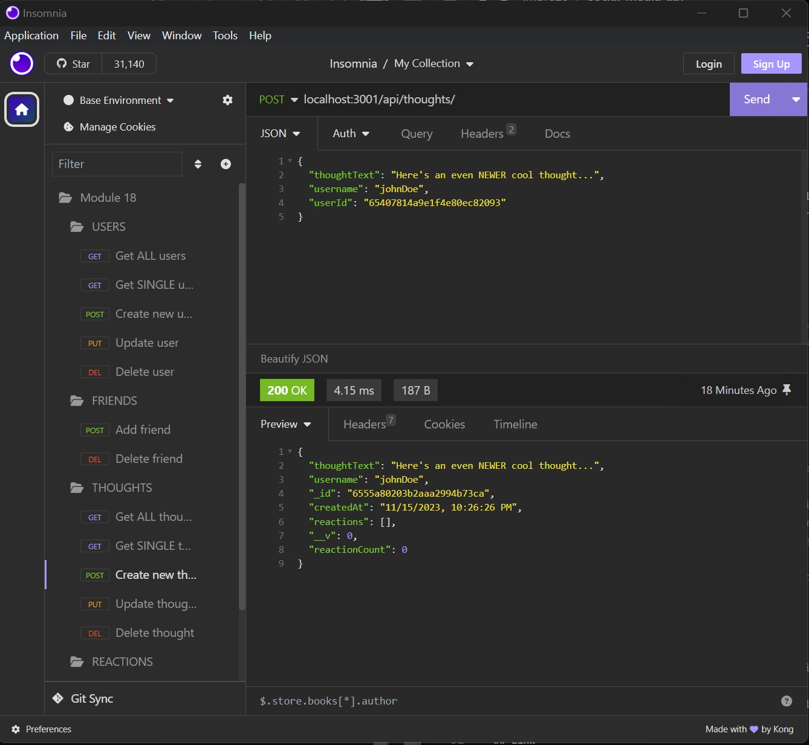

# social-media-api
This repository contains a built out API for a social network web application where users can share their 
thoughts, react to friends’ thoughts, and create a friend list. It utilizes Express.js for routing, a MongoDB
database, and Mongoose ODM.

## User Story
```md
AS A social media startup
I WANT an API for my social network that uses a NoSQL database
SO THAT my website can handle large amounts of unstructured data
```

## Acceptance Criteria
```md
GIVEN a social network API
WHEN I enter the command to invoke the application
THEN my server is started and the Mongoose models are synced to the MongoDB database
WHEN I open API GET routes in Insomnia for users and thoughts
THEN the data for each of these routes is displayed in a formatted JSON
WHEN I test API POST, PUT, and DELETE routes in Insomnia
THEN I am able to successfully create, update, and delete users and thoughts in my database
WHEN I test API POST and DELETE routes in Insomnia
THEN I am able to successfully create and delete reactions to thoughts and add and remove friends to a user’s friend list
```

## Examples

### Example of a GET request to fetch all users in the database:


### Example of a POST request to create a new thought for a user:


## Link

Click <a href="https://drive.google.com/file/d/1L3l_Q-PzCyyGoJECHl_UsT86dbzpz1va/view">here</a> to view the demonstration video! 
